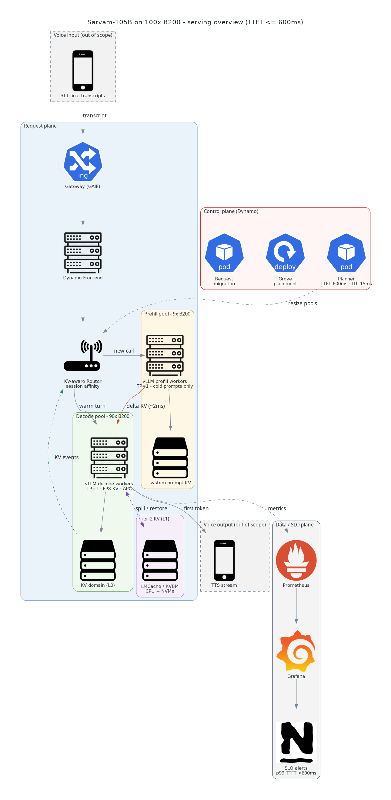
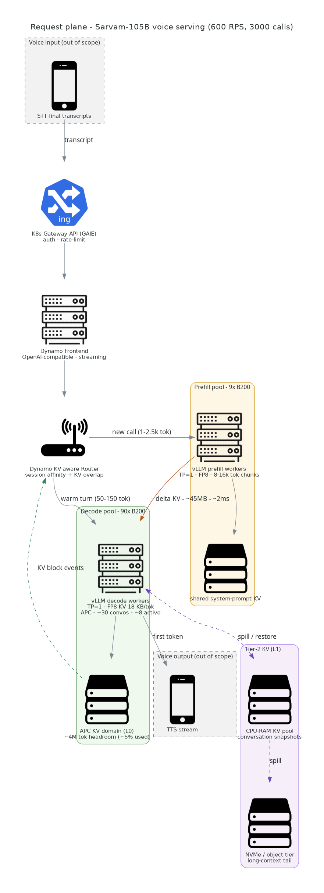
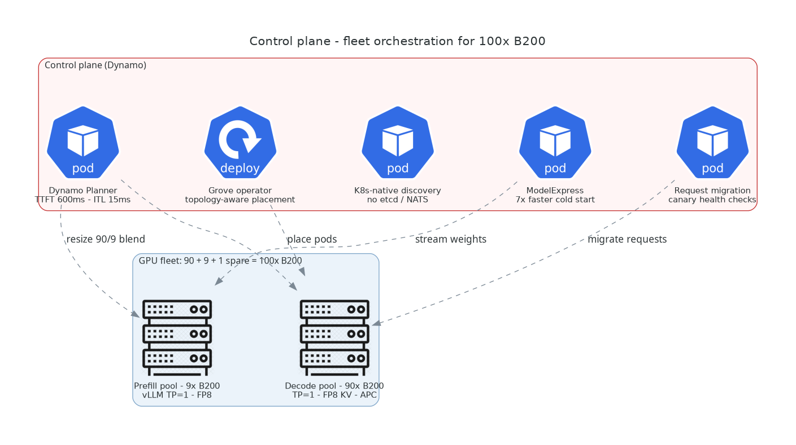
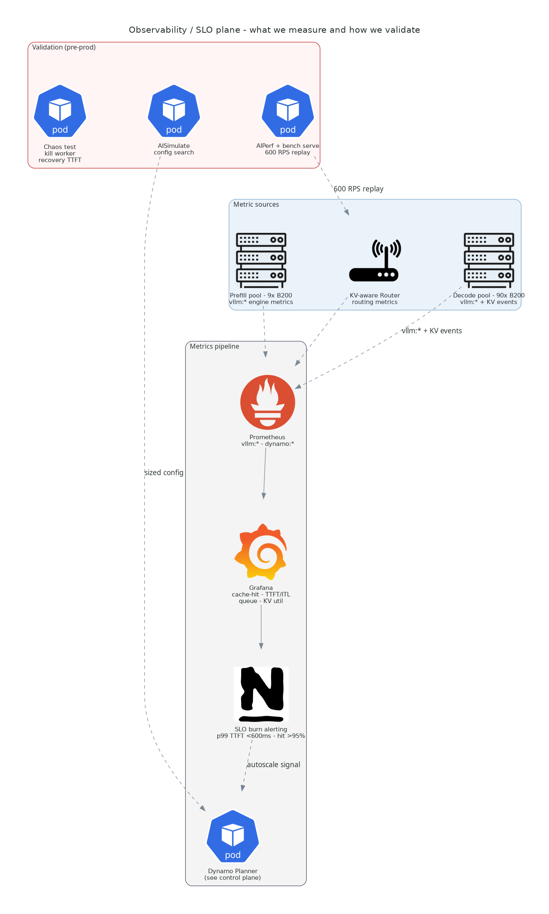

# Serving Sarvam-105B for 3,000 Concurrent Voice Calls on 100× B200

## Index

- [1. Requirements](#1-requirements)
- [2. Further analysis of provided requirements](#2-further-analysis-of-provided-requirements)
- [3. System Design](#3-system-design)
  - [3.1 Request plane](#1-request-plane)
  - [3.2 KV Cache](#2-kv-cache)
  - [3.3 Control Plane](#3-control-plane)
  - [3.4 Observability plane](#4-observability-plane)
  - [3.5 TTFT budget table](#5-ttft-budget-table)

## 1. Requirements
- Sarvam 105B LLM
- 3,000 Concurrent calls
- 600 Requests per second
- 100x B200 GPUs
- TTFT <= 600ms
- TPOT already optimized at 10-15 miliseconds

Task is to achieve targets, by optimizing cache hit rate and focusing on minimizing latency.

## 2. Further analysis of provided requirements

### 1. Prefill is cheap
- Sarvam 105B has MoE with top-8 + one shared expert per token.
- Each token's computation only involves 10.3B parameters
- For a cold 2,500 token prompt, arithmetically
  - 2 × 10.3×10⁹ × 2,500 ≈ 5.2×10¹³ FLOPs ≈ 52 TFLOP
- The NVIDIA B200 delivers 4,500 TFLOPS (4.5 PFLOPS) of dense FP8 tensor core performance per GPU.
- Even if we account for memory traffic, kernel launches, etc, and only consider effective capacity of 1,500 TFLOPS (i.e 1/3rd) ability
  - 52 ÷ 1,500 ≈ 0.035 s ≈ 35 ms

### 2. Multiturn prompts are monotonic
Turn N's prompt = turn N-1's prompt + new round information

- so we'll be strictly extending the prefix
- So if we ensure a new request, lands on the same GPU that served the previous turn, everything except the latest tokens are already sitting in HBM, fully computed.

### 3. TTFT Equation
TTFT will contain
- Router + gateway overhead: single digit noise
- Queue wait - A bursty situation where the home GPU is momentarily busy, but a seperate worse GPU instance is free.
  - important here because prefill is cheap
- Incremental prefill
- one decode step

### 4. Fitting a model on a GPU
- Sarvam 105B in FP8 is 105GB of weights, let us consider 115 gb total.
- B200 has 192 gb, so leaves us with ~70 gb of vram to spare
- Thus no point, in tensor parallelism, thus TP=1, one model copy per GPU.
- 100 fully independent workers, each with its own KV cache space
- KV cache is already optimized with MLA + FP8
- 576 numbers × 32 layers × 1 byte = 18,432 bytes ≈ 18 KB/token
- 70 GB allows us space for 4 million tokens
- 3000 calls / 100 GPUs, each GPU handles 30 conversations (pre-disaggregation)
- Allows each conversation to have upto 1,33,333 tokens which is already a very bloated context.

### 5. How to use the 100 GPUs
- Split GPUs into Prefill + Decode + 1 spare GPU
- Use Dynamo's SLA-driven autoscaler
  - You can provide it an objective function like `sla: {ttft: 600, itl: 15}` and it sizes pools towards that. So it reshapes prefill vs decode pool shapes.
  - Takes input live metrics (TTFT, ITL, prefill queue depth, GPU util, KV Util, etc)
  - Outputs pool shapes, per pool chunk sizes and concurrency limits

- Now split prefill:decode GPUs in ratios of 1:5 to upto 1:10
  - Referenced from deepseek style servings

- Math for number of active sequences on a GPU
  - arrival rate: 600 per second
  - request lifetime, assume 100 tokens * 12 ms (10-15 TPOT provided) = 1,2s
  - 600*1.2 active sequences= 720 total active sequences
  - Let's say each GPU gets 8 per instance
  - 720/8=90
  - Use 90 decode GPUs, 9 prefill GPUs
    - fits 1:9 ratio
  - beyond this, autoscaler will optimize pool sizes automatically

### 6. How to manage KV cache
- a GPU has space for 4 million tokens
- Per user has space of 133k tokens which is massive
  - the model's context window is 128k tokens
  - the mode's conversational variant used for voice agents `sarvam-105b-conversations`, has a 32k token context window
    - i.e every user has 4x of the context window itself
- Thus no need to evict kv cache
- Arithmatically we should have 95% cache hit rate. It is not 100% because
  - new tokens are always misses
  - first turns are always cold
  - restart, migrations, failures etc

## 3. System Design

### 1. Request plane

- The voice-agent runtime (out of scope) posts the STT transcript to an OpenAI-compatible streaming endpoint.
- K8s Gateway API handles auth/rate-limiting
- Dynamo Frontend owns the request entry point
- the **KV-aware Router** makes the one decision that matters:

  - **Warm turn → decode pool, session-affine.**
    - The conversation ID (from the telephony session) hashes to its home instance, whose APC holds the entire history.
    - Incremental prefill = 50–150 tokens, computed inline by the decode worker
      - (routing a 100-token delta through a prefill worker + transfer would *add* latency, not remove it).
  - **New call → prefill pool.**
    - Cold prompts (system prompt + tools + first utterance, 1–2.5k tokens) are computed on 8–16k-token chunks by prefill workers
    - then the **delta KV (~45 MB for 2.5k tokens at 18 KB/tok)** ships over NIXL/RDMA to the assigned decode instance in ~2–3 ms.
  - **First token streams back** through the Frontend to TTS.

### 2. KV Cache

| Tier | What | Latency | Role |
|---|---|---|---|
| **L0 — GPU APC** (per decode instance) | Stored in Home GPU memory | ~free | Hot path. Covers ~95% of turns by construction |
| **L1 — CPU-RAM KV pool** | Transfer over NIXL; 45 MB per 2.5k-token KV | 2–10 ms | **Backup**, Covers restarts/rollouts |
| **L2 — re-prefill** (any worker) | Recompute prefill | ≤ ~150 ms | Fallback|

- L1 Cache can be handled via
  - LMCache, or
  - Dynamo's KVBM which does GPU→CPU→SSD→remote natively on vLLM backend

### 3. Control Plane

Control all 100 GPUs, all the below are handled by **Dynamo**:

- 1. Planner, Dynamo's SLA driven autoscaler handling the GPU pools
- 2. Grove, k8s operator deciding which physical GPU each worker pod lands on
- 3. Model Express, streams weights GPU-to-GPU, speeds up cold starts
  - ex: if GPU restarts, etc
- 4. Fault Tolerance - canary + migration
  - Canary checks that a worker is healthy
  - Migration handles moving conversations to healthy workers

### 4. Observability plane

Prometheus scrapes vllm → Grafana dashboards → SLO-burn alerts → autoscale signal back to the Planner, closing the loop.

| Signal | Source | Target |
|---|---|---|
| Block-level prefix-cache hit rate | `vllm:gpu_prefix_cache_hit_rate` | **> 95%** |
| TTFT p50 / p99 | Dynamo router + engine histograms | p99 **< 600 ms** |
| ITL / TPOT p50 / p99 | `vllm:*` | p99 ≤ 15 ms (non-regression) |
| Prefill queue depth, KV util, `num_preemptions` | `vllm:*` | preemptions ≈ 0 (no-eviction regime check) |
| Routing decisions + KV events | `dynamo:*`, KV-event stream | hit-rate vs load tradeoff visible per instance |

### 5. TTFT budget table
| Path | Share of traffic | Compute | Queue + router | p99 total |
|---|---|---|---|---|
| Warm turn (affinity + APC hit) | ~95% | 5–15 ms (50–150 new tok) | ~100–150 ms | **~200 ms** |
| Cold new call (prefill pool + 45 MB transfer) | ~3–5% | 25–60 ms (1–2.5k tok, 30–40% MFU) | ~150 ms | **~350 ms** |
| Migration / restart (L1 restore; L2 recompute fallback) | rare | 2–10 ms transfer / ≤150 ms recompute | ~100 ms | **<400 ms** |
